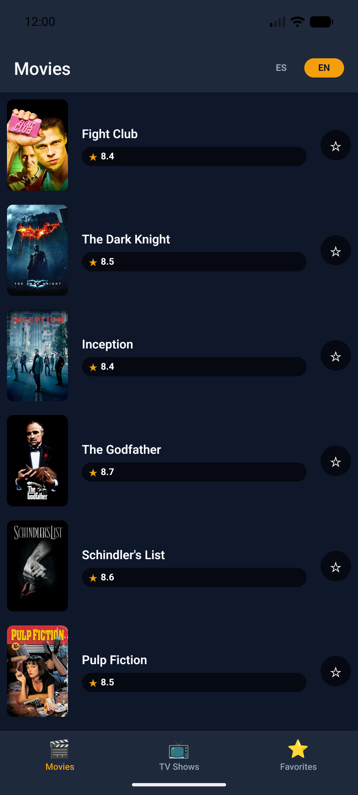
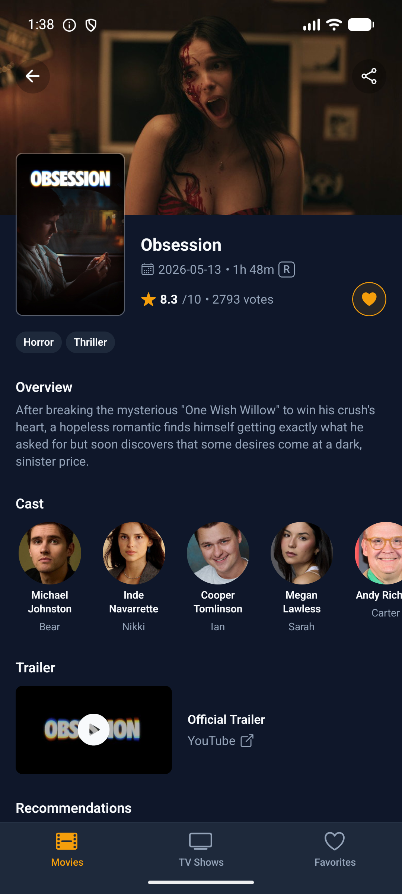

# MangoMovies

A React Native movies/TV browser built against [The Movie Database (TMDB)](https://www.themoviedb.org/) API: browse and search popular movies and TV shows, view details, and mark favorites — with offline-aware caching, i18n (es/en), and a few native-thread animations.

<p align="center">
  
  
</p>

## Prerequisites

- Node `>= 22.11.0` (see `package.json`'s `engines` field).
- React Native CLI environment set up for the platform you're targeting — follow the official [Set Up Your Environment](https://reactnative.dev/docs/set-up-your-environment) guide (Android: Android Studio + SDK + JDK; iOS: Xcode, macOS only). This project doesn't need anything beyond the standard bare React Native CLI setup.
- If something fails to build and you're not sure whether it's this project or your environment, run `npx react-native doctor` first — it diagnoses Node/Watchman/JDK/Android SDK/Xcode/CocoaPods and can fix several issues on its own with `npx react-native doctor --fix`.

## Getting a TMDB API key

1. Create a free account at [themoviedb.org](https://www.themoviedb.org/signup).
2. Go to your account's **Settings → API** section.
3. Generate an **API Read Access Token** (the long JWT-style v4 token — not the shorter v3 `api_key`).

## Environment variables

Copy `.env.example` to `.env` and fill in the token from the previous step:

```sh
cp .env.example .env
```

```
TMDB_ACCESS_TOKEN=your-v4-read-access-token
```

## Installation

```sh
npm install
```

iOS only (needed once, and again after any native dependency changes — this project uses `expo-image`, which requires CocoaPods):

```sh
cd ios
bundle install
bundle exec pod install
cd ..
```

## Running the app

Start Metro in one terminal:

```sh
npm start
```

Then, with an Android emulator already booted (or a device connected):

```sh
npm run android
```

Or, on macOS with a simulator available:

```sh
npm run ios
```

Android debug builds only target `arm64-v8a` (`android/gradle.properties`'
`reactNativeArchitectures`) — matches both an Apple Silicon Mac's emulator
and most physical Android devices, but a debug APK built this way won't
install on an `x86_64` emulator (Intel Mac/Windows/Linux) or an older
32-bit (`armeabi-v7a`) device. Build for a different target (or a release)
with:

```sh
cd android && ./gradlew assembleDebug -PreactNativeArchitectures=x86_64
```

## Running tests

Unit and component tests (Jest + React Native Testing Library):

```sh
npm test
```

Type-checking and linting:

```sh
npm run typecheck
npm run lint
```

End-to-end flows ([Maestro](https://maestro.mobile.dev/)), against an already-running emulator/simulator with the app already installed:

```sh
maestro test .maestro/<flow>.yaml
```

Three of the four flows (`movies-list-and-search`, `movie-details`, `favorites`) exercise the real TMDB API and need a valid `TMDB_ACCESS_TOKEN` in `.env` (rebuild the app after changing it — the token is baked in at build time via `react-native-dotenv`). `language-switch.yaml` doesn't call TMDB and passes regardless.

Run flows one at a time (or in a shell loop) rather than pointing Maestro at the whole `.maestro/` directory: all four flows share the same `appId`, and running them concurrently against a single emulator has them race for the same app instance instead of each getting a clean launch. A simple loop:

```sh
for flow in .maestro/*.yaml; do maestro test "$flow"; done
```

CI (`.github/workflows/ci.yml`) runs lint/typecheck and unit tests on every push. Its `e2e` job additionally needs a `TMDB_ACCESS_TOKEN` **repository secret** to run the three API-dependent flows — without it, the job falls back to running only `language-switch.yaml` so CI stays green rather than permanently red.

## Architecture decisions

The full architecture writeup — state management, navigation, styling, caching strategy, testing strategy, and the reasoning behind each choice — lives in [`docs/planning.md`](docs/planning.md) rather than duplicated here.

## Known limitations

- **iOS is unverified on this development machine** (no Xcode installed here). The codebase targets both platforms with no Android-specific APIs, and `pod install`/native config follow the standard bare-RN + Expo-modules pattern, but the iOS build itself hasn't been run end-to-end in this environment.
- **`mobile-mcp`** (the MCP server used for agent-driven interactive verification during development) is registered in this repo's Claude Code config but wasn't available mid-session (registering an MCP server requires a session restart to load) — interactive verification during development used direct `adb`/screenshot tooling instead, to the same effect.

All four Maestro flows, all main app flows (browsing, search, details, favorites, language switching, offline banner) against the real TMDB API, and the full CI-equivalent local suite (typecheck/lint/unit tests/real debug build) have been verified end-to-end.
